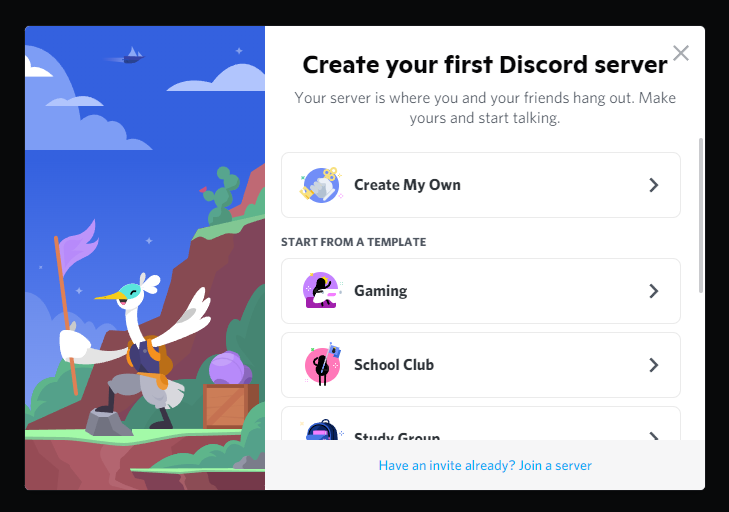
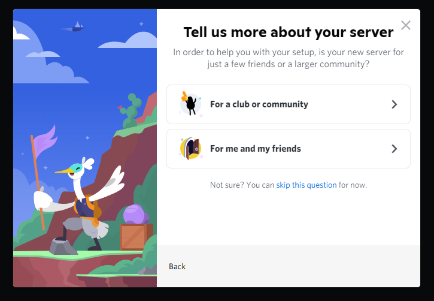
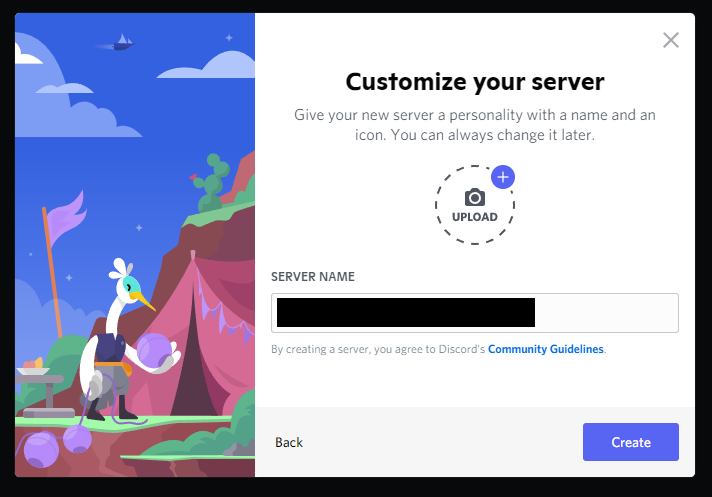
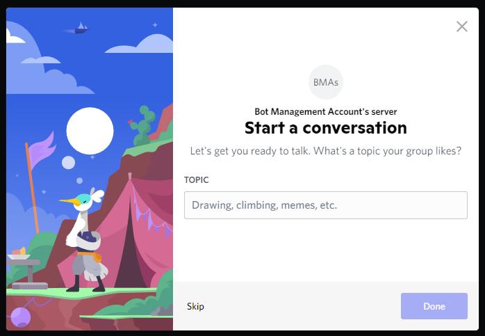
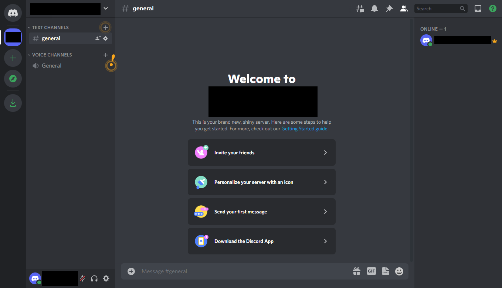
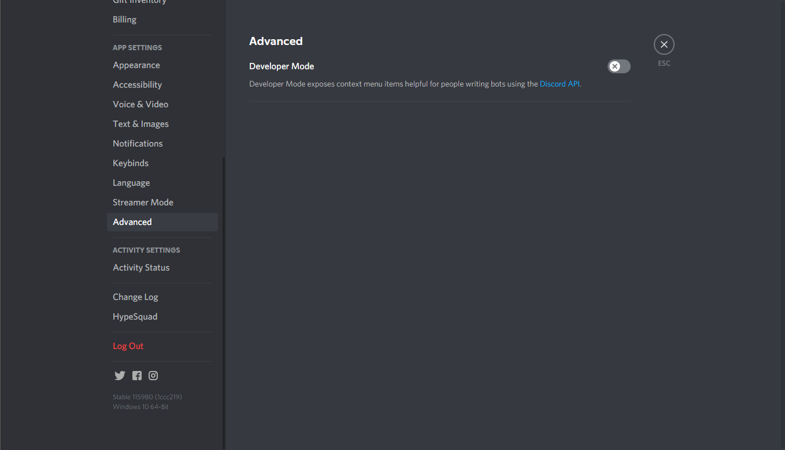
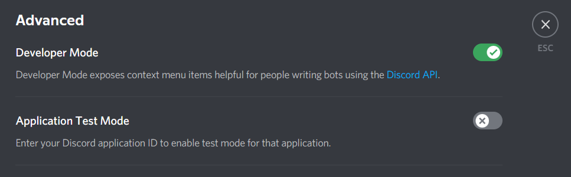

# Creating a new Discord Account
{: .no_toc }

## Table of contents
{: .no_toc .text-delta }

1. TOC
{:toc}

---

## Creating a New Discord Account
{: .d-inline-block }

|   It is recommended for users to create a separate account to create and manage their bots. For bots to function, they require your unencrypted, secure API key, which can be used to compromise your account. Use your personal account at your own risk. For users who wish to manage bots on an existing account, please skip this and jump ahead to the next section, [Enabling Developer Mode on Your Discord Account.](https://23o4i7.github.io/Sean-Sejin-Docs/docs/createDiscordAccount/#enabling-developer-mode)|
|---|
{: .d-inline-block }

First, go to Discord's [account creation page](https://discord.com/register) on any device and fill out the ***Create An Account*** form to create a new Discord account.

For a more detailed guide, Discord has a [Starter Guide](https://support.discord.com/hc/en-us/articles/360033931551-Getting-Started) and [Beginner's Guide](https://support.discord.com/hc/en-us/articles/360045138571-Beginner-s-Guide-to-Discord), for a step-by-step guide and to familiarize yourself with Discord's interface.

## Creating a Discord Server
{: .d-inline-block }

After creating an account, you will be prompted to create your first Discord server. You should see a screen that looks like this, or similar to the image below. 

1. Select ***Create My Own***. 

 

2. Select ***For me and my friends***.

3. Give your server a name. Server names are not unique and can contain any combination of letters and numbers. After naming the server, select the ***Create*** button.
 

4. When it prompts you to ***Start a Conversation***, you can write out a topic of your choice, or select ***Skip***.
 

 
5. Click ***Take me to my server!***, and it will bring you to your server's main page.

## Enabling Developer Mode
{: .d-inline-block }

Now that we are logged in, we will enable Discord's "Developer Mode" in the settings tab.

1. Open the settings tab via the cog wheel on the bottom left of the screen, besides your user profile.

2. On the left side menu, scroll down until you see the ***Advanced*** setting. When you select it, you should see all the Advanced settings, and one of them will be ***Developer Mode***. 

3. Click the ***x*** to enable Developer Mode. A second option will appear, ***Application Test Mode***. You can ignore this setting, it is reserved for Discord applications that require payment processes. 

Congratulations! Now that you have a Discord account set up and Developer Mode enabled, you can start making bots and applications on Discord!
