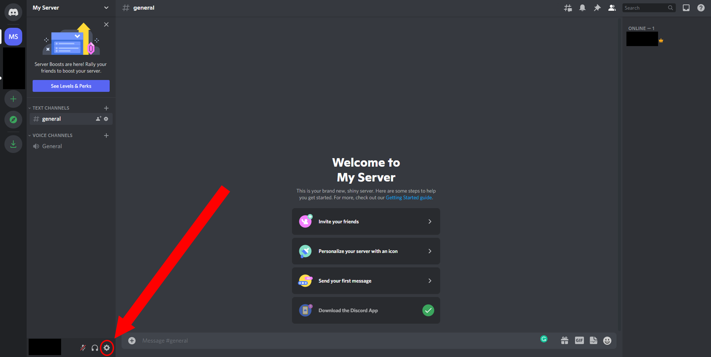

# Creating a New Discord Account
{: .no_toc }

## Table of Contents
{: .no_toc .text-delta }

1. TOC
{:toc}

---

## Creating a New Discord Account
{: .d-inline-block }

|  |
|-----|
|It is recommended for users to have a separate account to create and manage Discord applications, which include Discord bots. All Discord applications require your API key and client token, both of which can be used maliciously against you. Use personal accounts at your own risk. For users who wish to manage bots on an existing account and have a server where you are the owner, you may skip this step and jump ahead to the next section, [Enabling Developer Mode on Your Discord Account.](https://23o4i7.github.io/Sean-Sejin-Docs/docs/createDiscordAccount/#enabling-developer-mode) To create a new server, go to the next section, [Creating a New Discord Server.](https://23o4i7.github.io/Sean-Sejin-Docs/docs/createDiscordAccount/#creating-a-discord-server) |

First, go to Discord's [account creation page](https://discord.com/register) on any device and fill out the ***Create An Account*** form to create a new Discord account.

For a detailed guide to creating an account, Discord has a [Starter Guide](https://support.discord.com/hc/en-us/articles/360033931551-Getting-Started) and [Beginner's Guide](https://support.discord.com/hc/en-us/articles/360045138571-Beginner-s-Guide-to-Discord) for step-by-step instructions and an explanation about Discord's interface and features.

---

## Creating a Discord Server
{: .d-inline-block }

After creating an account, you will be prompted to create your first Discord server. You will need to create a server first before you can create your bot, because bots can only be added to servers by the server's owner. They also require special permissions only available to server owners or moderators.

You should now see a screen similar to the one shown in the image below.

1. Click ***Create My Own***.   

2. Click ***For me and my friends***.   

3. Give your server a name. Server names are not unique and can contain any combination of letters and numbers. After naming the server, click the ***Create*** button.   

4. When it prompts you to ***Start a Conversation***, you can put a topic of your choice, or click ***Skip***.   
 
5. Click ***Take me to my server!***, and it will bring you to your server's main page.

Under the users tab on the right side of your screen, you should see your username, along with a gold crown. This gold crown indicates you are the server owner.

---

## Enabling Developer Mode
{: .d-inline-block }

Now that we are logged in, we will enable Discord's Developer Mode in the settings tab. Developer Mode allows users to view important information that is normally hidden, for example, a server or client ID, which developers need to manage any application. 

Now you should be on your server's main page, which looks like the first image below.

1. Open the settings tab via the cog wheel on the bottom left of the screen, beside your user profile.   

2. On the left side menu, scroll down until you see the ***Advanced*** tab. Selecing it should show the Advanced setting ***Developer Mode***.   

3. Click the ***x*** to enable Developer Mode. A second option will appear, ***Application Test Mode***. You can ignore this setting for now, it is reserved for Discord applications that require payment processes.    

Congratulations! Now that you have a Discord account set up and Developer Mode enabled, you can start making bots and applications on Discord!