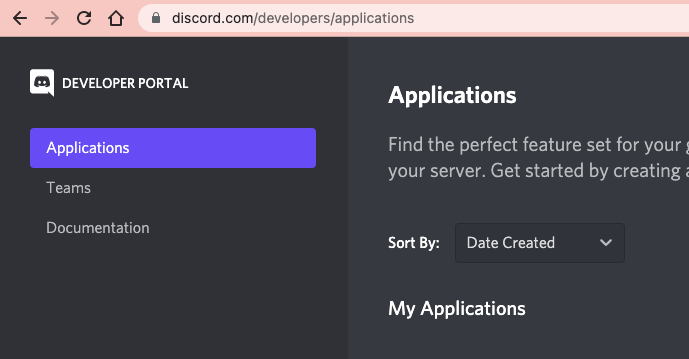
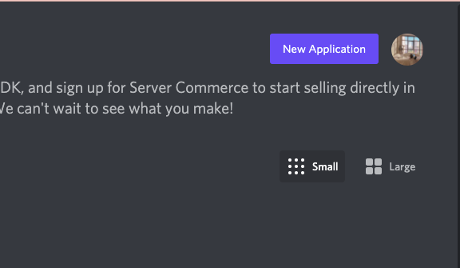
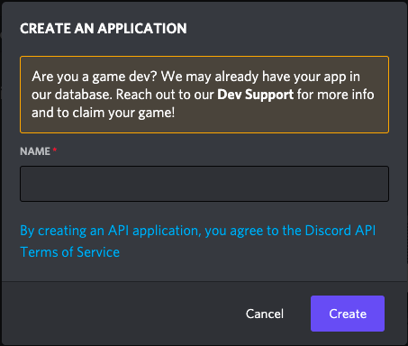
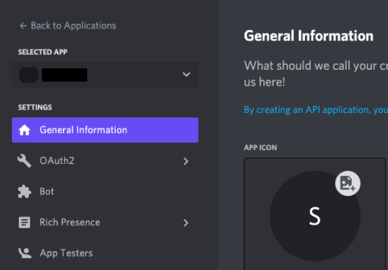
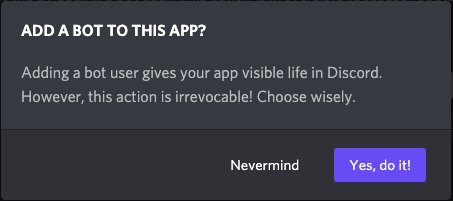
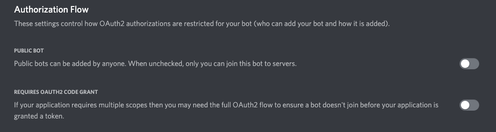
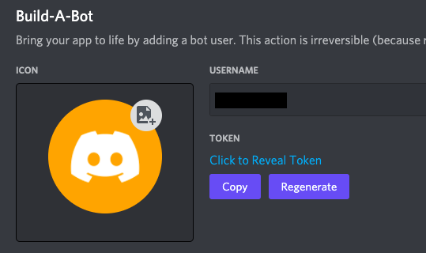

## Creating a new Discord application
1. Once you enable developer mode with your account, navigate to the [Application page.](https://discord.com/developers/applications)  

2. When you are on the Application page, you can see the button, **New Application**.  

3. Click the button, then you will see a pop up asking you to create the application name. Give the application a name and click **Create**.  

## Register the new application as a bot
1. After the application name is created, you will see the general information page. On the left side of the page, you will be able to see **Bot**.  

2. Go to the **Bot** tab and click **Add Bot**. You should confirm by clicking **Yes, do it!**  

3. After this step, you will see the default settings for Public Bot(checked) and Require OAuth2 Code Grant(unchecked). However, make both **unchecked** to keep your bot private.  

4. Congratulations! Your bot has been created. Now, click the **Copy** to copy the token. 
(This token is your bot’s password, so be extra careful not to share it with anyone. It will give others authorization to log in to your bot. If the token gets shared, click the **Regenerate** to create a new token for your bot.)  
