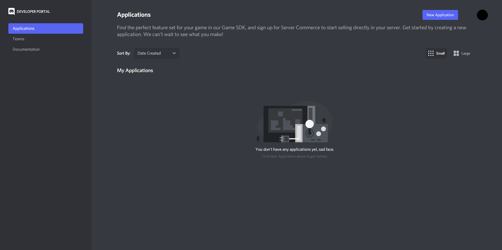

# Register a New Bot on Discord
{: .no_toc }

## Table of Contents
{: .no_toc .text-delta }

1. TOC
{:toc}

---

## Creating a new Discord application
In this step, we will walk through how to create a new Discord application using Discord's Developer Portal. This lets you create applications that are directly integrated with Discord's API.

1. Go to [***Applications*** inside the Developer Portal](https://discord.com/developers/applications), and click ***New Application***    

2. Give your new application a name then click _**Create**_.  

---

## Register the new application as a bot
This part will show you how to register your new application as a bot.

|  |
|---|
| This guide will only create a ***private*** bot, meaning other users cannot add your bot to their server. If you want to make your bot ***public***, please first read [this article](https://support-dev.discord.com/hc/en-us/articles/4404772028055-Message-Content-Privileged-Intent-for-Verified-Bots) regarding Discord's new changes to their API regarding verified bots. |

1. In the menu on the left side of the page, select the ***Bot*** tab and click ***Add Bot*** under the Build-A-Bot section.    

2. Confirm creating the bot by clicking, ***Yes, do it!***    

3. After this step, you will see the default settings for Public Bot (checked) and Require OAuth2 Code Grant (unchecked). Make both _**unchecked**_ to keep your bot private for now, then save your settings.    

4. Click _**Copy**_ to get your bot's token. Save this token somewhere, you will need this token when you start writing code for the bot later.
   

|  |
|---|
| This token acts like bot’s password, and ***under no circumstances should it be shared***. It will give others authorization to log in to your bot. If you think your token has been compromised, click ***Regenerate*** to create a new token for your bot. |

---

## Conclusion
{: .no_toc }

Congratulations! You've registered a bot on Discord! Now we can add it to our server to work with.