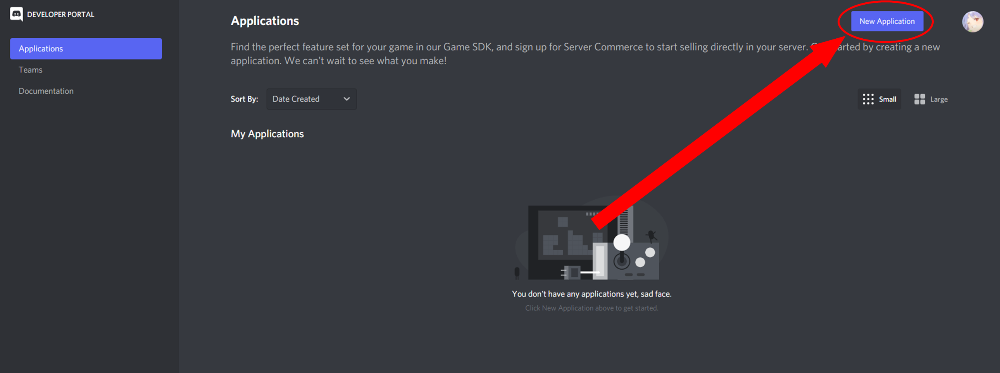
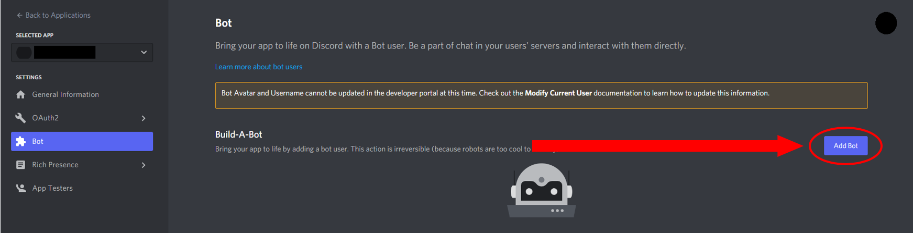
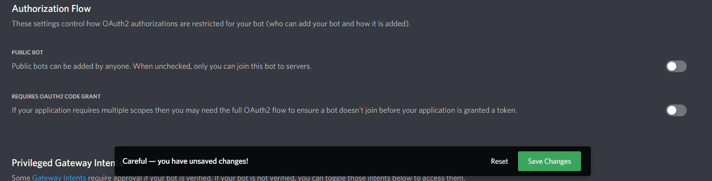

# Register a New Bot on Discord
{: .no_toc }

## Table of Contents
{: .no_toc .text-delta }

1. TOC
{:toc}

---

## Creating a new Discord application
In this task, we are going to walk through how to create a new Discord application in order to work with the library and the Discord API in general.

1. Once you enable developer mode with your account, navigate to the [Application page](https://discord.com/developers/applications) and click ***New Application***    

2. Click the button, then you will see a pop up asking you to create the application name. Give the application a name and click _**Create**_.  

---

## Register the new application as a bot
This part will help you how to register the new application to create a bot.

1. After the application name is created, you will see the general information page. On the left side of the page, you will be able to see **Bot**.    

2. Go to the _**Bot**_ tab and click _**Add Bot**_. You should confirm by clicking _**Yes, do it!**_    

3. After this step, you will see the default settings for Public Bot (checked) and Require OAuth2 Code Grant (unchecked). Make both _**unchecked**_ to keep your bot private for now, then save your settings.    

|  |
|---|
| If you want to keep your bot as ***public***, please first read [this article](https://support-dev.discord.com/hc/en-us/articles/4404772028055-Message-Content-Privileged-Intent-for-Verified-Bots) regarding Discord's new changes to their API regarding verified bots. |
 

4. Now, click the _**Copy**_ to get your token. You will need this token when you start writing code for the bot. 
  

|  |
|---|
| This token is your bot’s password, and ***under no circumstances should it be shared***. It will give others authorization to log in to your bot. If you think your token has been compromised, click ***Regenerate*** to create a new token for your bot. |

 

Congratulations! You've registered a bot on Discord! Now we can add it to our server to work with.