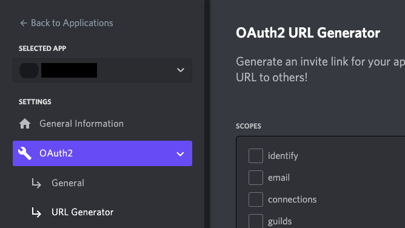
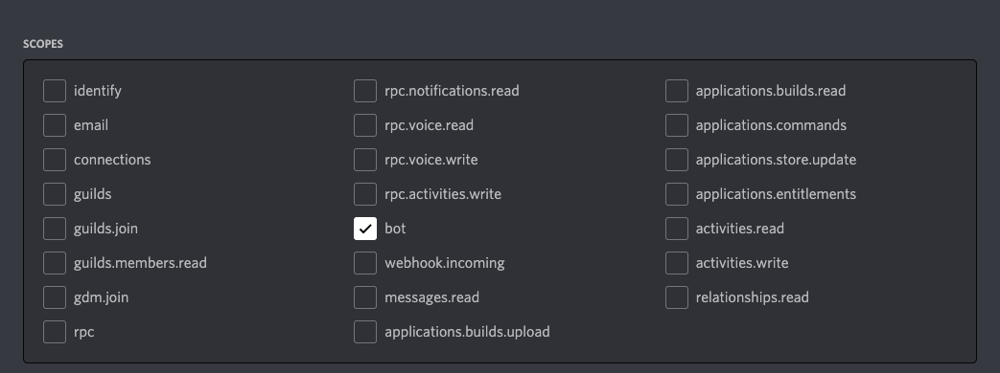
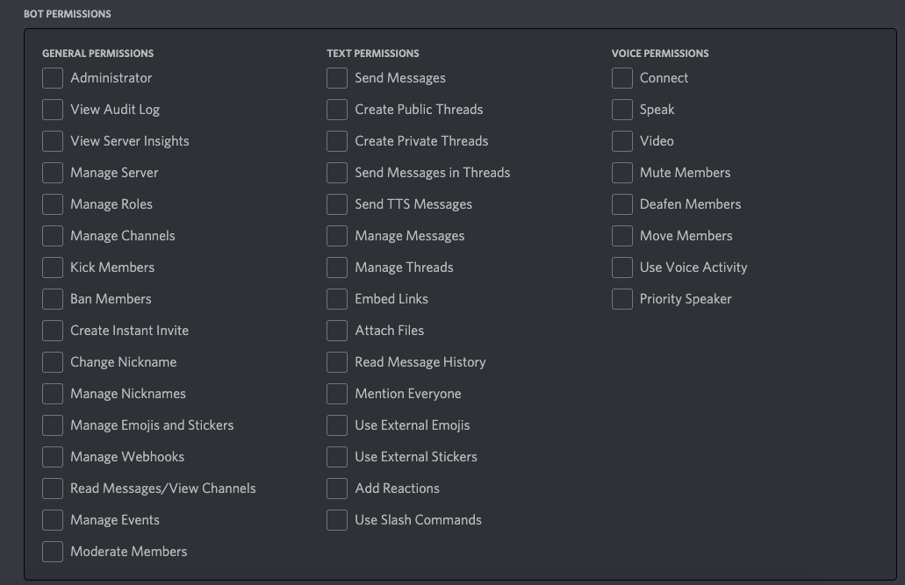

# Connecting the Bot To Your Server
{: .no_toc }

## Table of Contents
{: .no_toc .text-delta }

1. TOC
{:toc}

---

## Authorize and connect the bot to a server
In this task, inviting your bot to a server is the main part. Create an invite URL for your bot to join a server.

1. Go to the _**OAuth2**_ tab, and click the _**URL Generator**_.  

2. Once you see the screen below, click the _**Bot**_ under the _**Scopes**_ section.  

3. Under the _**Bot Permissions**_ section, choose the permissions you want for the bot. 
The bot can have as many as permissions, but it depends on your needs. Be careful with the _**Administrator**_ permission for the bot.  

4. After choosing the necessary permissions for the bot, click the _**copy**_ to get a URL that can be used to invite the bot to a server.  

5. Paste the URL address into your browser, choose a server that you want to invite the bot to, and click _**Authorize**_.  

6. After all the steps above went through, make sure your account has _**Manage Server**_ permissions to add the bot. 
You have successfully created and invited the bot for your server, and you will be able to see the bot on the right side of your Discord.  

7. Now, it’s time to write some code for the bot.
