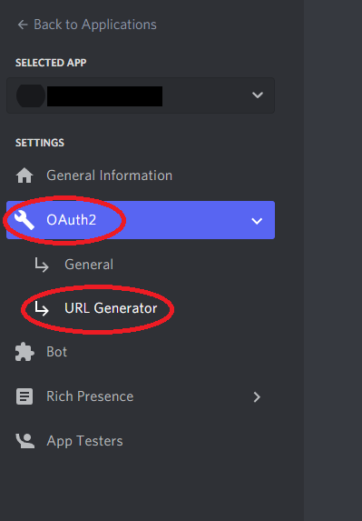

# Connecting the Bot To Your Server
{: .no_toc }

---

## Authorizing Bot Permissions

In this section, we will give the bot its necessary permissions, then we will create an invite link to add the bot to our server.

1. In the ***Bot** tab, go to _**OAuth2**_ and click _**URL Generator**_.   

2. In the ***scopes*** table, click  ***bot*** and ***applications.commands*** under the _**Scopes**_ section.   

3. Under the ***Bot Permissions*** table, choose the ***Admininstrator*** setting. Keep in mind you can restrict and remove permissions later.   

4. After choosing the necessary permissions for the bot, click the _**copy**_ to get a generated URL that can be used to invite the bot to a server.   

5. Paste the URL address into your browser, select your server, and click _**Authorize**_.   

6. You should be able to see the bot in your server on the users list.  

---

## Conclusion
{: .no_toc }

Congratulations! Now that we've added the bot to our server, we can start writing the code for the bot.