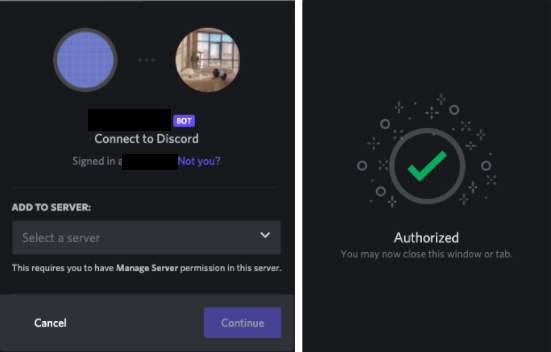

# Connecting the Bot To Your Server
{: .no_toc }

---

## Authorizing Bot Permissions
In this task, inviting your bot to a server is the main part. Create an invite URL for your bot to join a server.

1. In the application page, click the ***Bot*** tab.   

2. Go to the _**OAuth2**_ tab, and click the _**URL Generator**_. In the table as you see below, click  ***bot*** and ***applications.commands*** under the _**Scopes**_ section.   

3. Under the ***Bot Permissions*** section, choose the permissions you want for the bot. The bot can have as many as permissions, but it depends on your needs. For this application, we can just use the ***Admininstrator*** setting.   

4. After choosing the necessary permissions for the bot, click the _**copy**_ to get a generated URL that can be used to invite the bot to a server.   

5. Paste the URL address into your browser, choose a server that you want to invite the bot to, and click _**Authorize**_.   

6. You should be able to see the bot in your server on the users list.  

Congratulations! Now that we've joined the bot to our server, we can start writing the code for the bot.