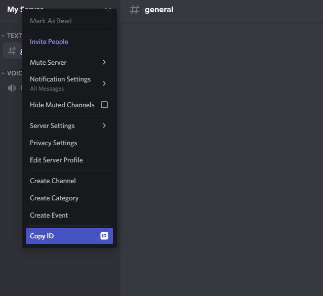

# Initializing and Setting Up the Bot
{: .no_toc }

## Table of Contents
{: .no_toc .text-delta }

1. TOC
{:toc}

---

|  |
|---|
| Before continuing, ensure that you have an IDE like Visual Studio Code, and Node.js installed on your machine. Next, check your Node.js version by opening any terminal, such as Command Prompt on Windows, or Terminal on a Mac or Linux machine. Inside the terminal, type `node -v`, and that will show you the Node.js version installed on your machine. Make sure that the version is greater than _`V16.9.0`_. |

Now that we've added the bot to our server, we can start building the brains and some basic functions for it.

## Creating the Initial Files

First, create a new folder to contain all of your files. Inside your folder, create two new files:

* `app.js`
* `token.json`

Now, open a terminal and move into the folder with the files you created using the command, `cd <folder path>`. To get the full path of a folder, follow this [tutorial for Windows](https://techdows.com/2022/01/windows-11-copy-as-path-and-its-shortcut.html), or this [tutorial for Mac](https://www.igeeksblog.com/how-to-copy-file-folder-path-from-mac-finder/#:~:text=Triple%2Dclick%20the%20file%20path,V%20wherever%20it%20is%20required.). 

Once you have moved into the folder, ***do not*** close this terminal, unless you are confident you can easily set it up again. You will need this instance of the terminal for more steps later on.

In the terminal, enter `npm init`. This will initialize the folder and allow you to easily keep track of files and different libraries you will need to use for this project. You will be prompted by the terminal and shown something like this.


Hit **Enter** until you see the prompt for _`test command`_, or 4 times. For this field, write `nodemon app.js`. The `nodemon` command is for a library we will install later, which automatically re-runs Node.js apps when you make any changes. It is an incredibly important tool for any web-based application.

Once it completes, you should see two new files inside your folder:

* `package.json`
* `package-lock.json`

These files will store data and keep track of the different libraries that you may use in your project. Inside the ***package.json*** folder, you can also enter custom scripts that you can use for any purpose, for example, testing. 

<!-- Next, open the `token.json` folder. You will need to get your special token you received when you [created a new bot](https://23o4i7.github.io/Sean-Sejin-Docs/docs/creatingANewDiscordApplication/). Once you've got it, inside the file, write:

```json
{
    "token": "<your token here>"
}
```

This will keep your token more secure, as it is not directly accessible to anyone who can see your bot. -->

|  |
|---|
|If you plan on uploading this project to Git, create a `.gitignore` file with `node_modules` and `token.json` inside. This will stop sensitive information from being published onto your Git repository. |

---

## Installing Libraries

By itself, JavaScript does not have the capability to create a bot that is integrated with Discord. This requires the use of libraries and modules that we will have to install on top  of our project.

First, go back to the terminal, and type in `npm install nodemon discord.js discord-api-types`. This will install three libraries, `nodemon`, `discord.js` and `discord-api-types`.

* `nodemon` is a library that watches your web app's directory for any changes or modifications. It will automatically restart or stop your app in the event of a modification or an error.
* `discord.js` is a library built off of Discord's API. This allows you to get and send data directly via Discord, which is an incredibly powerful feature, and makes your job os creating a bot much easier.
* `discord-api-types` is an extension of `discord.js` that allows you to create custom scripts and commands for Discord applications. We will use this library later to write some basic commands for the bot.

Open the `app.js` file, and at the top, write:

```js
// Require the neccessary libraries
const fs = require('fs');
const discord = require("discord.js");
const { token } = require('./token.json');


// Create client instance for your bot to log in
const client = new discord.Client({ intents: [discord.Intents.FLAGS.GUILDS] });

// Brings in commands from your /commands folder
client.commands = new discord.Collection();
const commandFiles = fs.readdirSync('./commands').filter(file => file.endsWith('.js'));

// Imports commands
for (const file of commandFiles) {
	const command = require(`./commands/${file}`);
	client.commands.set(command.data.name, command);
}

// Runs your commands
client.on('interactionCreate', async interaction => {
	if (!interaction.isCommand()) return;

	const command = client.commands.get(interaction.commandName);

	if (!command) return;

	try {
		await command.execute(interaction);
	} catch (error) {
		console.error(error);
		await interaction.reply({ content: 'There was an error while executing this command!', ephemeral: true });
	}
})

// When you bot has logged in, it will print out in the console "Ready!"
client.once('ready', () => {
    console.log('Bot is online!');
})

// Your bot will use its token to log in and connect to your server
client.login(token);
```

This code will log your bot into Discord and allow it to start running. Next, let's add some basic functionality for the bot to perform.

---

## Adding Basic Commands and Functions

Because this guide is only for a very simple and small-scale bot, we are able to put all the commands inside the `app.js` file. But as bots grow over time, the feasability of this will greatly decrease. As we add more and more functionality, we will fall victim to a trap known as ["if-else hell".](https://www.freecodecamp.org/news/so-youre-in-if-else-hell-here-s-how-to-get-out-of-it-fc6407fec0e/)

To avoid this, we will use [modular architecture](https://codesource.io/how-to-modularize-javascript-code/) to store different commands in different files. Our directory should end up looking something similar to this:

```
    discord_bot/
        |-- node_modules/
        |-- token.json
        |-- app.js
        |-- package.json
        |-- package-lock.json
        |-- runCommands.js
        |-- commands/
                |-- command1.js
                |-- command2.js
```

Now that we have an idea of what a bot should look like, let's start by making the `runCommands.js` file.

---

### runCommands.js

1. First, go back to your console and enter `npm install @discordjs/rest discord-api-types`. This is an extension for the `discord.js` library that you can use to write applications and functions using a method called REST API (For a detailed explanation of REST API, read [this article](https://www.ibm.com/cloud/learn/rest-apis)).<br><br>

2. Next, create a JavaScript file inside your folder with all the bot files named `runCommands.js`. Then we will add in the initial code. At the top of the file, add:<br><br>
    ```js
    // Require files and modules
    const fs = require('fs');
    const { REST } = require('@discordjs/rest');
    const { Routes } = require('discord-api-types/v10');
    const { clientID, guildID, token } = require('./token.json');

    // Creates the list of commands from the /commands folder
    const commands = [];
    const commandFiles = fs.readdirSync('./commands').filter(file => file.endsWith('.js'));

    // Requires the commands into the app.js file
    for (const file of commandFiles) {
        const command = require(`./commands/${file}`);
        commands.push(command.data.toJSON());
    }

    // Creates REST API token
    const rest = new REST({ version: '10' }).setToken(token);

    // Verifies all commands are successfully read or will return an error 
    rest.put(Routes.applicationGuildCommands(clientID, guildID), { body: commands })
        .then(() => console.log('Successfully registered application commands.'))
        .catch(console.error);
    ``` 
    This will import in all the required libraries to create your own commands for your Discord bot.<br><br>

3. Now the file is set up, we need to add the `clientID` and `guildID` into your `token.json` file. The client ID is also the application ID for your application. You can get this ID by going back to the application page in the developer portal, selecting your application, then clicking ***Copy*** under the Application ID.  Same with your bot's token, your client and guild IDs are sensitive and ***should never be shared***.<br><br><br><br>
   
4. For your guild ID, go to your server and right click the server's name or icon. You will see an option, ***Copy ID***.<br><br><br><br>

5. Now that you have both your client and guild IDs, inside your `token.json` folder, add both IDs so you get:<br><br>

    ```json
    {
        "token": "<Your token here>",
        "guildID": "<Your guild ID here>",
        "clientID": "<Your client ID here>"
    }
    ```

<br>

|  |
|---|
| You must store your guild and client IDs as ***strings*** not ***numbers***. You will not be able to run your application if you do so. |


Now that we've set up the bot to register commands from the `/command` folder, we can make the `/command` folder and start adding functions.

---

### Commands

First, inside your main project folder, create a new folder named, `commands`. This folder will store all of the JavaScript files containing all of your different functions.

Now let's add two different commands to our bot. The first command will be a simple reply that we can trigger by greeting the bot, and the second will generate a random number between 1 and 100.

|  |
|---|
| When you create a slash command using the `SlashCommandBuilder` library, you will have to set a name for the command using the `.setName()` method. All command names must be all lowercase letters, they cannot contain numbers or uppercase letters, or else they will not work. |

---

#### hello.js

Create a new file inside your `/commands` folder named `hello.js`. Inside this file, write:

```js
const { SlashCommandBuilder } = require('@discordjs/builders');

module.exports = {
    data: new SlashCommandBuilder()
        .setName('hi')
        .setDescription('Greets the user back'),
    async execute(interaction) {
        return interaction.reply(`Hi ${interaction.user.username}!`);
    },
};
```

This command will activate whenever you type `/hi` in your server, and the bot will reply back to you with _`Hi <Your username>`_.
<br>

#### randomNumber.js

Create another file inside your `/commands` folder named `randomNumber.js`. Inside this file, write:

```js
const { SlashCommandBuilder } = require('@discordjs/builders');
const getRandomNumber = (range) => Math.floor(Math.random() * range);

module.exports = {
	data: new SlashCommandBuilder()
		.setName('randomnumber')
		.setDescription('Generates a number between 0 and 100'),
	async execute(interaction) {
		return interaction.reply(`Your number is ${getRandomNumber(100)}!`);
	},
};
```

This command will activate whenever you type `/number` in your server, and the bot will reply back with `Your number is <number>!`

<br>
Congratulations! You've now added some functions to your bot! If you want to add more commands, just follow the same steps above, and change the name, description, and reply as you see fit!