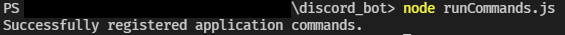
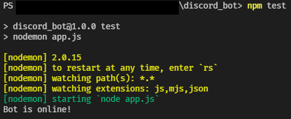

# Running Your Bot
{: .no_toc }

---

## Starting Up Your Bot

Now that we've set up all the starter files and added some commands for our bot to use, we can start up the bot. 

1. First we have to register the commands that we created. Return to your terminal and run the file by writing `node runCommands.js`. When all your commands are registered, you should recieve a response from the console saying _`Successfully registered application commands`_.    
2. Start up the bot with your custom script, `npm test`. When your bot is ready, your console will say _`Bot is online!`_.  
3. Now go back to your server, and the bot should be online. Typing `/` in the message bar will show all the commands that we created and their description.    
4. Now try out the commands. The bot should reply to you with whatever command you gave it.    
5. To turn off your bot, press **Ctrl+C** twice in your terminal. Then to turn it back on, enter `npm test` or `node app.js` in the terminal.

---

## Conclusion
{: .no_toc }

Congratulations! You've successfully created your first Discord bot! If you want to scale up the bot or add some more functionality, Discord.js has [extensive documentation](https://discord.js.org/#/docs/discord.js/stable/general/welcome) on their different functions, and Discord's has their own [detailed documentation](https://discord.com/developers/docs/intro) about their API.