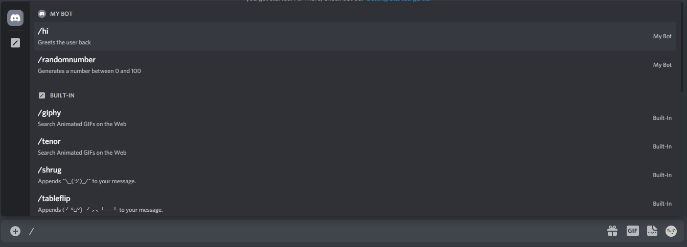
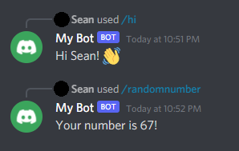

# Running Your Bot
{: .no_toc }

---

## Starting Up Your Bot

Now that we've set up all the starter files and added some commands for our bot to use, we can start up the bot. 

1. First we have to register the commands that we created. Return to your terminal and run the file by writing `node runCommands.js`. When all your commands are registered, you should recieve a response from the console saying _`Successfully registered application commands`_.  
2. Now that the commands are registered, you can start up your bot. Start up the bot with the custom script you created, which by default is `npm test`. Node.js will start running your bot with nodemon, and when your bot is ready, in the console, it will say _`Bot is online!`_.   
3. Now go back to your server, and you should see your bot online. Now try typing `/` in the message bar. You should see the commands that we created and a description.    
4. Now try out the commands. The bot should reply to you with whatever command you gave it.    
5. To turn off your bot, go back to your terminal and press **Ctrl+C** twice. Then to turn it back on you can enter `npm test`, `node app.js`, or whatever script you created.

Congratulations! You've successfully created your first Discord bot! If you want to scale up the bot or add some more functionality, Discord.js has [extensive documentation](https://discord.js.org/#/docs/discord.js/stable/general/welcome) on their different functions, and Discord's has their own [detailed documentation](https://discord.com/developers/docs/intro) about their API.