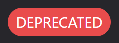

# Introduction
{: .no_toc }
The purpose of this document is to guide beginners on Discord how to create a Discord Bot. The sections of this document will introduce you to the simplest and easiest way to create your own Discord Bot.

A Discord Bot is created by a user with a developer account to automate various actions on Discord. Discord’s public API is used to make Bots take some actions. The features of each bot are various by its creator or user, but there are certain basic roles that are shared among the bots, such as sending messages, modifying roles, communicating with other servers, and etc.

## Intended User
This document is targeted towards to the following users:
Any users who want to create a Discord Bot.

## Prerequisites
To follow each step of the process, you need the following:

  * Access to a computer
  * Secure internet connection
  * A developer account on Discord 
  * Working knowledge of Javascript and Node.js
  * Basic understanding of synchronous and callback functions in Javascript


## Software Requirements
Before proceeding, ensure you have the following installed:

  * Node.js V16.9.0+
  * An Integrated Development Environment (IDE)
    * Visual Studio Code (Recommended), WebStorm, Atom, Eclipse, Notepad++ (Not recommended)
  * Any up-to-date browser
    * Google Chrome, Firefox 38+, Opera, Microsoft Edge 17+, Chromium 79+, or Safari 11+

## Typographical Conventions

| Convention   | Appearance  | Examples |
|:-------------|:------------|:---------|
| Important Items and Emphasis | ***Bold Italics*** | ***user, console, instructions*** |
| Key Press | **Bold** | **Ctrl+Shift+C, Alt+A, Enter** |
| Links | [Link]() | [This is a Link](https://23o4i7.github.io/Sean-Sejin-Docs/) |
| Code Input | `code` | ```console.log("Hello World)``` |
| Console Output | _`code italics`_ | _`console.log("Hello World")`_ |
| Warning |  |  |
| Important Note |  |  |